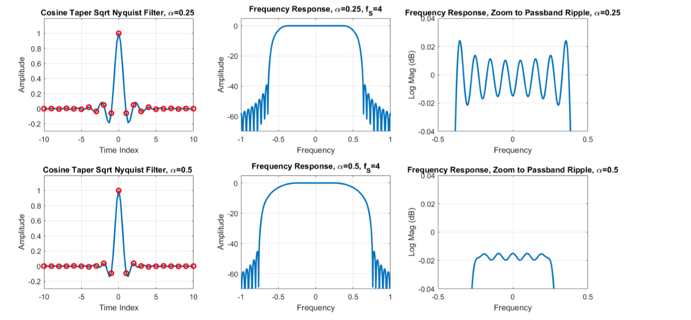
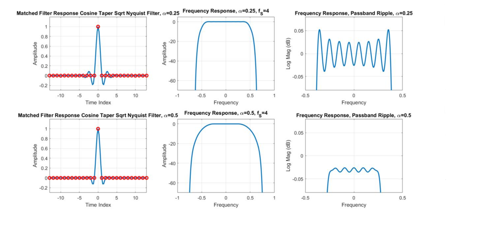
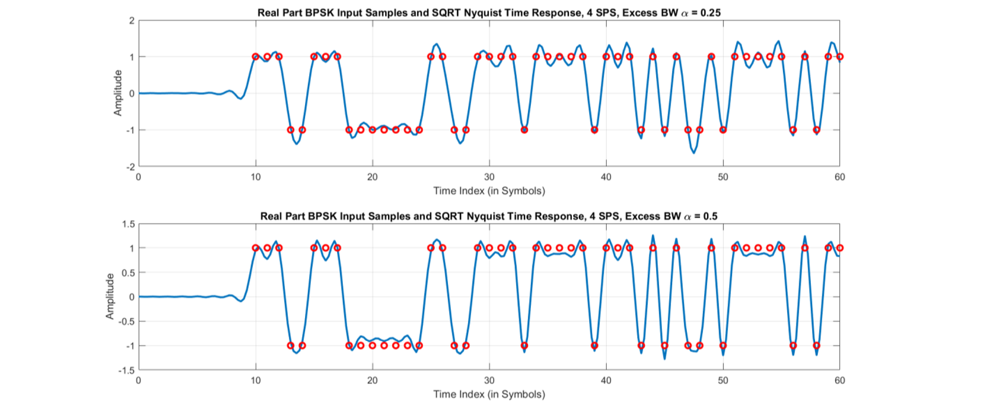
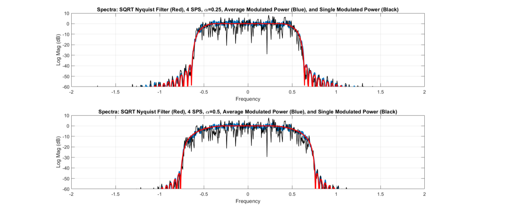
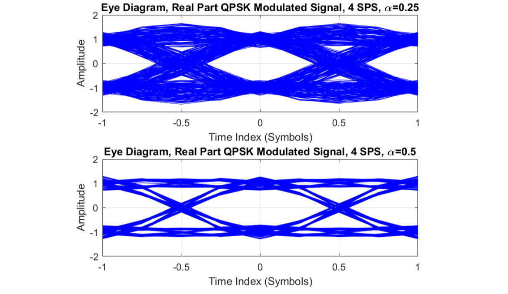
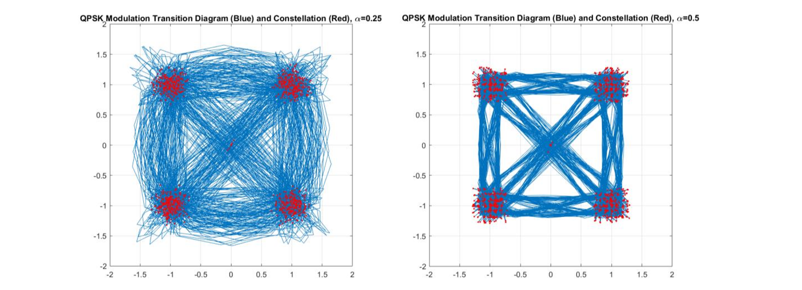
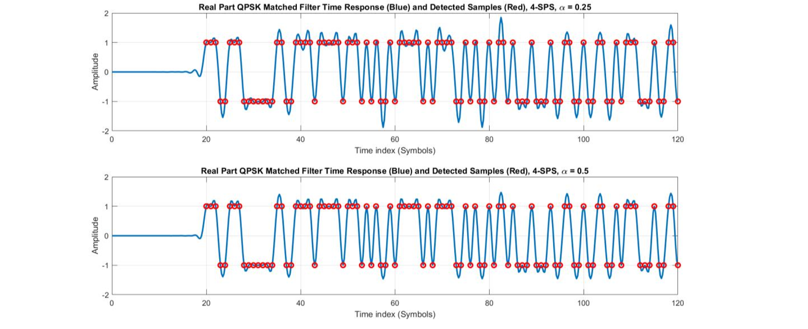
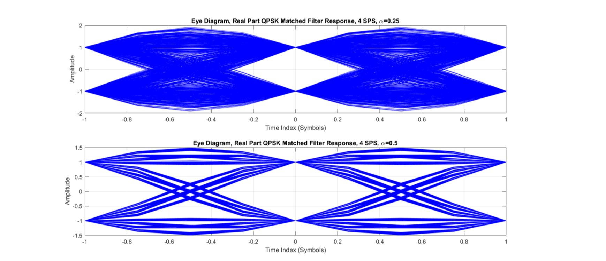
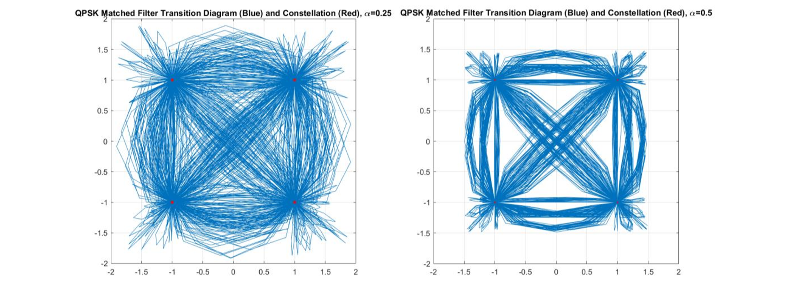
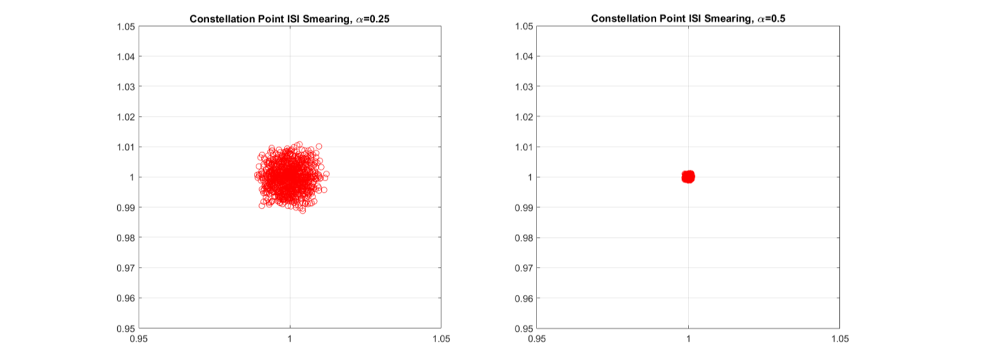

# SQRT-Nyquist-Filters
### Software Defined Radios
Shaping Filters in transmitter side and Matched Filters in reciever side

## Shaping Filter

## Matched Filter

## Shaped QPSK Time Series (1000 symbols)

## Kaiser Windowed 1024-tap Power Spectrum

## Eye Diagram of Shaped Time Series

## Constellation Diagram of Shaped Time Series

## Matched QPSK Time Series

## Eye Diagram of Matched Time Series

## Constellation Diagram of Matched Time Series

## Constellation Point |S| Smearing

